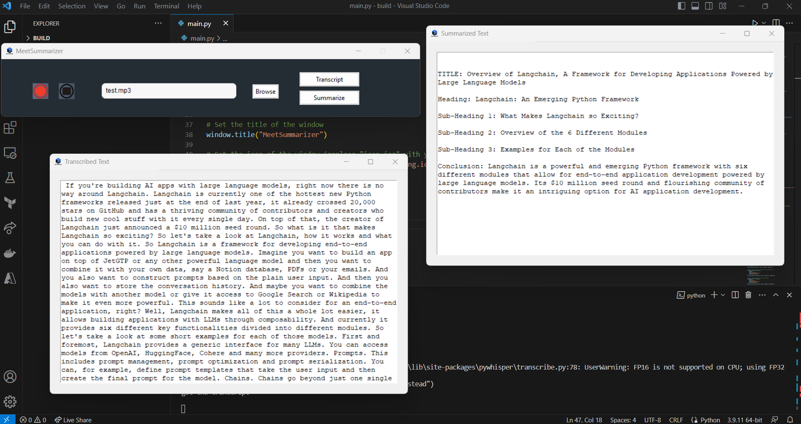

# MeetSummarizer


## Steps to run the application:

**Step 1:** Clone the github repository.

**Command:**

```
git pull https://github.com/liteshghute/meetsummarizer.git main
```

**Step 2:** Open the "constant.py" file and add your openai key.

**Step 3:** Install the required packages with the following command:

**Command:**

```
pip install -r requirements.txt
```

**Step 4:** Run the application.

**Command:**

```
python main.py
```

## Application Screenshot


